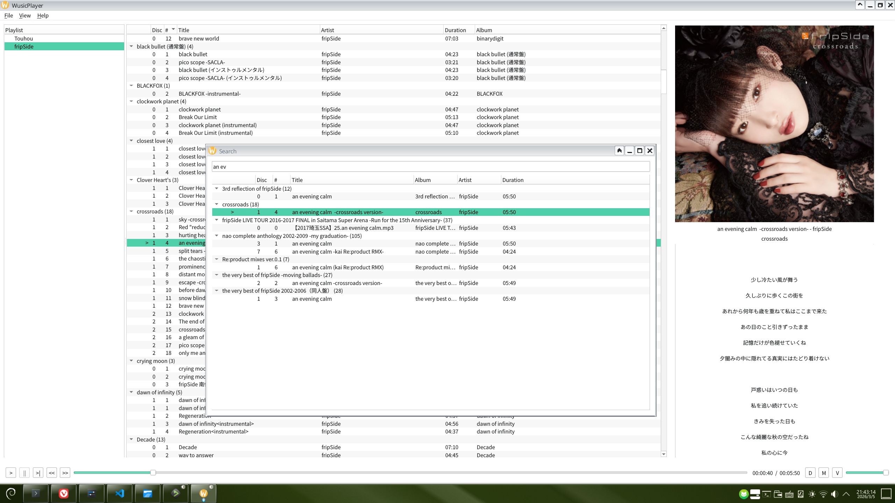

# WusicPlayer

<p align="center">
  A modern local music player for Linux desktop environments.
</p>

<p align="center">
  
  
  
  
  
  
</p>

---

> [!WARNING]
> WusicPlayer is currently under development.\
> Stability and compatibility are not guaranteed.

---

## Overview

**WusicPlayer** is a personal Qt project with two practical goals:

1. Build a usable, modern local music player for Linux desktop workflows.
2. Provide a Linux-side alternative experience inspired by **Foobar2000 + foobox (v6) theme**, without aiming for heavy professional audio features.
    > if you need, please use DeadBeef

This project is under active refactoring and feature iteration.

---

## Project Status

> **Work in Progress**

- Core playback and playlist features are available.
- Architecture is being migrated toward a clearer `view` / `controller` / `model` / `core` split.
- Packaging is **not provided yet**. (such as `.deb` / `.rpm` / `.exe`)
- Bugs are possible; feedback is welcome.

---

## Features (Current)

- Local audio playback
- Playlist management (create, rename, copy, remove, import, save)
- Playback controls (play/pause/stop, next/previous, seek, volume, mute)
- Multiple play modes
- Library view + search panel
- Cover and lyrics panel (ongoing improvements)

---

## Screenshots



---

## Architecture

```text
src/
├── controller
├── core
├── model
├── view
└── static
```

- **view**: UI components and interaction rendering  
- **controller**: orchestration and decoupling layer  
- **model**: player, playlist, and domain logic  
- **core**: shared types, config, and utilities
- **static**: qt static resources

---

## Build & Run (Linux)

### Dependencies

- Qt 6 (recommended >= 6.5)
- CMake >= 3.21
- C++ compiler with C++17/20 support
- TagLib
- magic-enum
- pkg-config

### VS Code + CMake Tools

This project is mainly developed and built with **VS Code + CMake Tools**.

To build the development env:

1. Install Qt (used in this project: `~/Qt/6.10.2/gcc_64`, configure at `CMakePreset.txt`)
2. Open this folder in VS Code
3. Select a Kit (GCC + Ninja)
4. Configure and Build from CMake Tools

### Command-Line (with cmake preset)

1. set your qt path first, than setup cmake environment
    ```bash
    cmake --preset dev-local-qt
    ```

2. build 
    ```bash
    cmake --build --preset build-local-qt
    ```

3. run
    ```bash
    build/src/WusicPlayer
    ```
> if system Qt libs & manually intalled Qt are both exists, use `cmake --preset` to select which you wanna use
---

## Tests

> Test coverage is currently limited and still evolving

### Build with tests enable (default)

`WUSIC_BUILD_TESTS` is enabled by default.

```bash
cmake --preset dev-local-qt
```


### Run tests (CLI)
```bash
ctest --preset test-local-qt
```

### Run tests (VS Code)
- Open **Testing** panel in VS Code
- Refresh test discovery
- Run all / selected tests

> Automated testing is available, but a full dedicated QA process is not in place yet.
---

## TODO

- [x] Complete controller-layer migration and stabilize interfaces
- [x] Improve audio device switching behavior
- [ ] Replace the current search proxy model with an independent one
- [ ] Binding shortcut keys
- [ ] Polish UI/UX and visual theme consistency
- [ ] Expand unit test coverage
- [ ] Evaluate distribution formats (AppImage / Flatpak / package repos)
- [ ] ...

---

## Contributing

Issues and PRs are welcome.

Suggested workflow:

- Keep commits small and focused
- Ensure the project builds before opening PR
- Prefer behavior-preserving refactors in separate commits

---

## License

This project is licensed under **GPL-3.0**.  
See the `LICENSE` file for details.

---

## Acknowledgements

- Qt
- [TagLib](https://github.com/taglib/taglib)
- UX inspiration from [Foobar2000](https://www.foobar2000.org) / [foobox](https://github.com/dream7180/foobox-en) (no official affiliation)
- [lrc-parser](https://github.com/WuZhenhuan428/lrc-parser)
