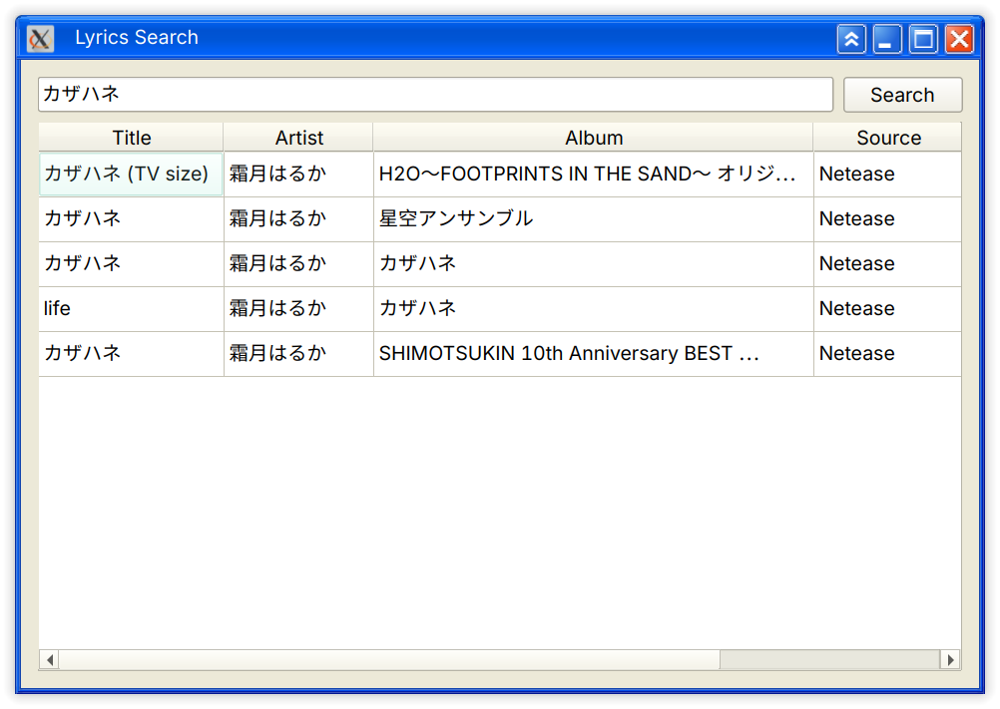
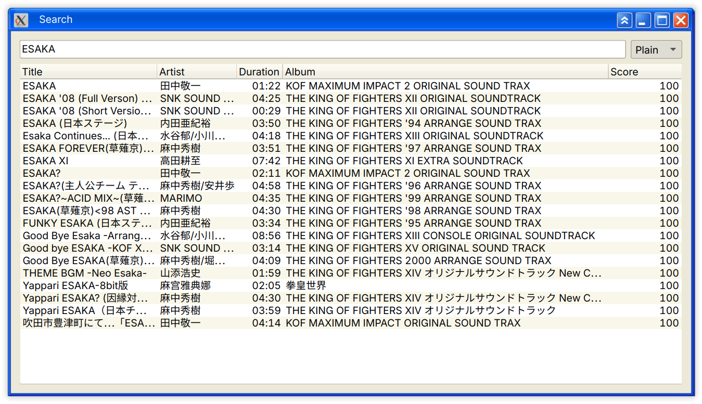
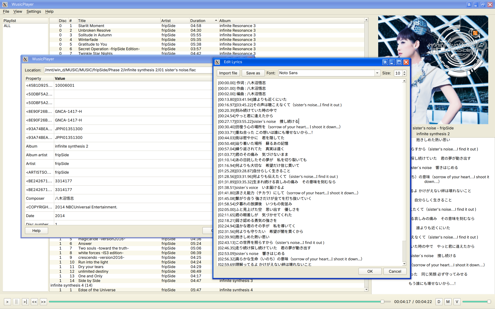

# WusicPlayer

<p align="center">
  <a href="README.md">English</a> | <a href="README_zh.md">中文</a>
</p>

<p align="center">
  一个面向 Linux 桌面环境的现代本地音乐播放器。
</p>

<p align="center">
  
  
  
  
  
  
</p>

---

> [!WARNING]
> WusicPlayer 当前仍处于开发阶段。\
> 稳定性和兼容性不作保证。

---

## 项目概述

**WusicPlayer** 是一个个人 Qt 项目，有两个实际目标：

1. 构建一个适用于 Linux 桌面工作流的实用、现代本地音乐播放器。
2. 在 Linux 端提供受 **Foobar2000 + foobox (v6) 主题** 启发的替代体验，并不追求重量级的专业音频功能。

该项目正在积极重构和功能迭代中。

---

## 项目状态

> **开发中**

- 核心播放和播放列表功能已可用。
- 架构遵循模块化的 `view` / `controller` / `service` / `model` / `core` 分层设计。
- 尚未提供打包（如 `.deb` / `.rpm` / `.AppImage`）。
- 可能存在 bug，欢迎反馈。
- 部分功能（如自定义标题栏）依赖 X11/XCB，在 Wayland 下可能无法正常工作。

---

## 功能特性

### 播放功能
- 本地音频文件播放（基于 FFmpeg + miniaudio）
- 播放、暂停、停止、上一首/下一首、进度跳转、音量控制、静音
- 多种播放模式（顺序播放、随机播放、单曲循环、列表循环）
- 音频设备切换（输出设备选择）
- 十段均衡器，支持自定义预设

### 播放列表管理
- 创建、重命名、复制、删除播放列表
- 导入/导出播放列表
- 多列表格视图，支持列排序
- 灵活的排序表达式（如 `%artist% %album% | %track_number%`）

### 音乐库
- 基于目录的音乐库扫描与管理
- 曲目元数据展示（艺术家、专辑、流派、年份、比特率等）
- 封面图片显示

### 歌词功能
- 同步歌词显示（支持内嵌歌词和外部 LRC 文件）
- 桌面歌词悬浮窗（开发中）
- 网络歌词搜索（网易云音乐源）
- 内置歌词/标签编辑器

### 搜索功能
- 全库和播放列表全文搜索
- 基于内存的搜索引擎，支持实时过滤

### 界面与自定义
- 主题系统，支持系统主题、内置主题（深色/浅色）和外部插件主题
- 基于 QStyle 的自定义渲染（不使用 QSS）
- 可配置的快捷键
- 自定义图标

### 数据管理
- 通过 `WusicPlayer.json` 实现配置持久化
- 标签元数据写回音频文件
- 启动时恢复播放状态

---

## 截图
主窗口：


网络歌词搜索：


播放列表内搜索：


标签查看与歌词编辑器：


均衡器与自定义图标：


---

## 架构设计

项目采用受 **MVC 启发** 的模块化分层架构，职责分明：

```text
src/
├── app_controller.cpp/h    # 应用级协调器（AppController）
├── main.cpp                 # 入口文件
├── controller/              # 控制器层 —— 视图与模型之间的桥梁
│   ├── PlaybackController   # 播放编排
│   ├── PlaylistController   # 播放列表增删改查
│   ├── shortcuts_controller # 快捷键管理
│   └── search_backend/      # 搜索查询处理
├── model/                   # 数据模型与视图模型
│   ├── playlist/            # 播放列表数据模型
│   ├── search_model/        # 搜索数据模型
│   └── ShortcutsViewModel/  # 快捷键配置模型
├── view/                    # UI 组件（Qt Widgets）
│   ├── MainWindow           # 主窗口外壳（UI 容器）
│   ├── WControlBar/         # 播放控制栏
│   ├── LibraryWidget/       # 音乐库浏览器
│   ├── playlist/            # 播放列表面板
│   ├── search_panel/        # 搜索界面
│   ├── DesktopLyricsWidget/ # 桌面歌词悬浮窗
│   ├── eq_widget/           # 均衡器面板
│   ├── tag_edit_widget/     # 元数据/标签编辑器
│   ├── SettingsPanel/       # 设置页面
│   ├── SidePanel/           # 导航侧边栏
│   └── dialogs/             # 模态对话框
├── service/                 # 服务层 —— 跨模块业务逻辑
│   ├── playback_service     # 音频播放生命周期管理
│   ├── playback_restore_service  # 启动时恢复播放状态
│   ├── library_interaction_service # 音乐库文件操作
│   ├── tag_writeback_service     # 元数据写回文件
│   └── theme_service        # 主题应用与管理
├── core/                    # 核心基础设施
│   ├── types.h              # 共享数据类型（TrackMetaData、SortRule 等）
│   ├── player_types.h       # 播放器专用类型
│   ├── search_types.h       # 搜索专用类型
│   ├── hsv_types.h          # 色彩空间类型
│   ├── player/              # 音频引擎（FFmpeg + miniaudio）
│   ├── ConfigManager/       # 基于 JSON 的配置持久化
│   ├── LyricsFetcher/       # 网络歌词获取（网易云 API）
│   ├── theme/               # 主题引擎（基于 QStyle，支持插件）
│   └── utils/               # 音频工具、路径辅助
└── static/                  # Qt 资源文件（图标、图片）
```

### 设计原则

- **AppController** 作为顶层协调器，负责连接控制器、服务和视图。
- **MainWindow** 是一个轻量的 UI 外壳，业务逻辑位于控制器和服务中。
- **Services** 封装跨模块关注点（播放、音乐库、标签、主题）。
- **Models** 持有数据并提供面向视图的接口（如 `ShortcutsViewModel`）。
- **Core** 提供共享类型、音频引擎、配置管理和主题系统。

---

## 依赖项

| 依赖       | 版本        | 用途                                                        |
|------------|-------------|-------------------------------------------------------------|
| Qt 6       | ≥ 6.5       | Core、Widgets、Multimedia、Network、SVG                     |
| FFmpeg     | ≥ 4.x       | 音频解码（libavcodec、libavformat、libavutil、libavfilter） |
| TagLib     | ≥ 1.x       | 音频元数据读写                                              |
| OpenSSL    | ≥ 1.1       | HTTPS 网络歌词获取                                          |
| ZLIB       |             | 数据压缩                                                    |
| magic_enum | header-only | C++ 枚举静态反射（作为子模块引入）                          |
| lrc-parser | header-only | LRC 歌词格式解析器（作为子模块引入）                        |

---

## 构建

详细的构建说明请参见 [BUILDING.md](docs/BUILDING.md)，涵盖 Linux、Windows (MSVC) 和 Windows (MSYS2/MinGW) 平台。

### 快速开始（Linux）

```bash
# 1. 安装依赖
sudo apt install qt6-base-dev qt6-multimedia-dev qt6-svg-dev \
    libavcodec-dev libavformat-dev libavutil-dev libavfilter-dev \
    libtag1-dev libssl-dev zlib1g-dev ninja-build pkgconf git

# 2. 克隆仓库（含子模块）
git clone --recurse-submodules https://github.com/your/wusicplayer.git
cd wusicplayer

# 3. 构建
cmake --preset debug
cmake --build --preset debug
```

---

## 测试

> 测试覆盖率目前有限，仍在完善中。

`WUSIC_BUILD_TESTS` 默认开启。测试使用 CMake 的 CTest。

```bash
# 带测试构建
cmake --preset debug

# 运行测试
cd build/debug && ctest
```

测试模块：
- `test/playlist/` — 播放列表模型单元测试
- `test/AudioScanner/` — 音频文件扫描测试

---

## 待办事项

- [x] 自定义 FFmpeg + miniaudio 播放后端
- [x] 控制器层迁移（解耦 MainWindow）
- [x] 音频设备切换
- [x] 独立搜索引擎
- [x] 快捷键绑定
- [x] 网络歌词搜索（网易云音乐）
- [x] GUI 均衡器（10 段）
- [x] 主题系统（基于 QStyle，插件架构）
- [ ] 音频频谱可视化
- [ ] 媒体库管理器
- [ ] 扩展单元测试覆盖率
- [ ] 分发打包（AppImage / Flatpak / .deb）
- [ ] ...

---

## 参与贡献

欢迎提交 Issue 和 PR！

- 保持提交小而专注。
- 提交 PR 前确保项目能够构建且测试通过。
- 遵循现有代码风格和架构模式。

---

## 许可证

本项目使用 **GPLv3** 许可证。详见 [LICENSE](LICENSE)。

---

## 致谢

- [Foobar2000](https://www.foobar2000.org/)
- [foobox](https://github.com/dream7180/foobox-en) -- UI 灵感来源
- [FFmpeg](https://ffmpeg.org/) -- 音频解码
- [miniaudio](https://miniaud.io/) -- 音频输出
- [TagLib](https://taglib.org/) -- 元数据处理
- [magic_enum](https://github.com/Neargye/magic_enum) -- C++ 枚举反射
- [Qt](https://www.qt.io/) -- 应用框架
