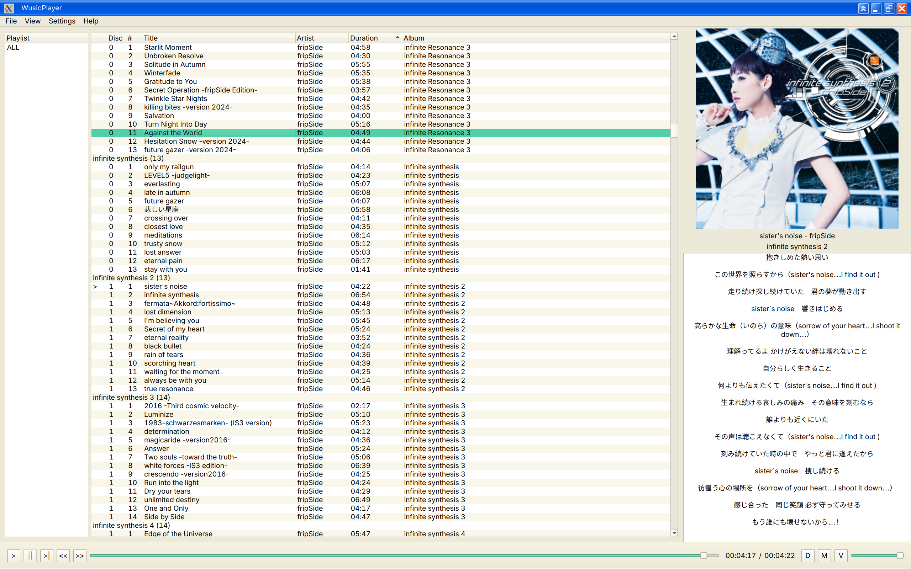
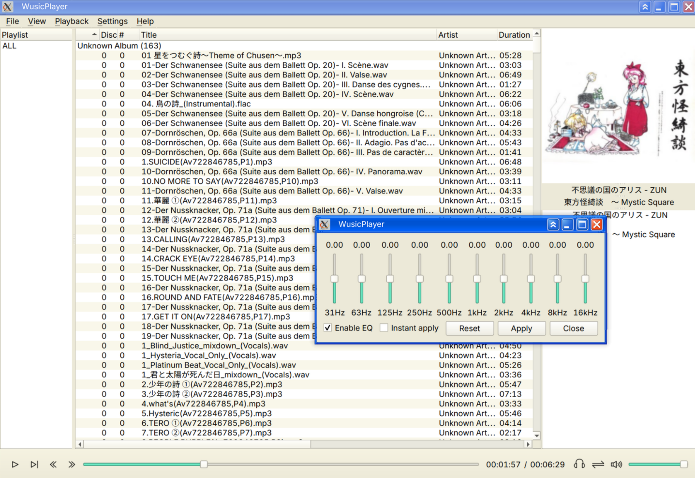

# WusicPlayer

<p align="center">
  <a href="README.md">English</a> | <a href="README_zh.md">中文</a>
</p>

<p align="center">
  一个面向 Linux 桌面环境的现代本地音乐播放器。
</p>

<p align="center">
  
  
  
  
  
  
</p>

---

> [!WARNING]
> WusicPlayer 当前仍处于开发阶段，稳定性和兼容性不作保证。

---

## 简介

WusicPlayer 是一个个人 Qt 项目，有两个目标：

1. 构建一个适用于 Linux 桌面工作流的实用、现代本地音乐播放器。
2. 在 Linux 端提供受 **Foobar2000 + foobox (v6) 主题** 启发的交互体验（不追求重量级的专业音频功能）。

项目采用模块化的 `view / controller / service / model / core` 分层架构，使用 FFmpeg + miniaudio 播放后端、TagLib 标签读写、SQLite FTS5 音乐库搜索。

## 功能特性

### 播放
- 本地音频播放（FFmpeg 解码 + miniaudio 输出）
- 播放 / 暂停 / 停止 / 上一首 / 下一首 / 进度跳转 / 音量 / 静音
- 播放模式：顺序、随机、单曲循环、列表循环
- 音频输出设备切换
- 十段均衡器（自定义预设）

### 播放列表
- 创建、重命名（内联编辑）、复制、删除、保存
- 导入文件 / 文件夹（可配置"未入库文件"的添加策略）
- 多列表格视图，支持列排序、自定义列
- 灵活的排序表达式（如 `%artist% %album% | %track_number%`）
- 列表内拖动排序

### 音乐库
- 基于目录的音乐库扫描与增量更新（文件监控 + 定时 reconcile）
- 媒体库浏览：按艺术家 / 专辑 / 流派 / 文件夹 / 年份分组
- 元数据展示与编辑（写入文件）
- 封面显示

### 搜索
- **媒体库搜索**：SQLite FTS5，支持前缀匹配与子串匹配（CJK 友好）
- **播放列表内搜索**：内存索引，实时过滤
- 搜索结果直接播放，并同步定位到主界面

### 歌词
- 同步歌词（内嵌 / 外部 LRC）
- 桌面歌词悬浮窗
- 网络歌词搜索（网易云音乐源）
- 内置歌词 / 标签编辑器

### 界面与自定义
- 主题系统：系统主题、内置主题（深 / 浅）、外部插件主题
- 基于 QStyle 的自定义渲染（不使用 QSS）
- 可配置快捷键
- 自定义图标

### 数据
- `WusicPlayer.json` 配置持久化
- 标签元数据写回音频文件
- 启动时恢复播放状态

## 截图

| 主窗口 | 均衡器 |
|---|---|
|  |  |

更多截图见 [`docs/screenshots/`](docs/screenshots/)。

## 快速开始（Linux）

```bash
# 1. 安装依赖
sudo apt install qt6-base-dev qt6-multimedia-dev qt6-svg-dev qt6-sql-dev \
    libavcodec-dev libavformat-dev libavutil-dev libavfilter-dev \
    libtag1-dev libssl-dev zlib1g-dev ninja-build pkgconf git

# 2. 克隆仓库（含子模块）
git clone --recurse-submodules <repository-url>
cd WusicPlayer

# 3. 配置并构建
cmake --preset debug
cmake --build --preset debug

# 4. 运行
./build/debug/src/WusicPlayer
```

更详细的构建说明（含 Windows / macOS）见 [`docs/BUILDING.md`](docs/BUILDING.md)。

## 测试

```bash
cmake --preset debug
cd build/debug && ctest
```

现有测试模块（8 个）：
- `lrc_parser_core_test` — LRC 解析
- `tb_playlist` — 播放列表模型
- `tb_add_file_policy` — 文件添加策略
- `tb_library` — 音乐库 / FTS5 搜索
- `tb_library_browse` — 媒体库浏览模型
- `tb_search_backend` — 搜索后端
- `tb_playback_queue` — 播放队列
- `utils_audio` — 音频工具

## 文档

| 文档 | 说明 |
|---|---|
| [`docs/ARCHITECTURE.md`](docs/ARCHITECTURE.md) | 架构设计：分层、模块、关键机制、命名约定 |
| [`docs/USAGE.md`](docs/USAGE.md) | 使用指南：界面布局、右键菜单、拖拽、搜索、快捷键 |
| [`docs/BUILDING.md`](docs/BUILDING.md) | 各平台构建说明 |
| [`docs/THEME_SYSTEM.md`](docs/THEME_SYSTEM.md) | 主题系统（含外部插件编写） |
| [`docs/history/`](docs/history/) | 历史重构设计与决策记录 |

## 待办事项

- [ ] 音频频谱可视化
- [ ] 智能播放列表（保存的查询）
- [ ] 扩展单元测试覆盖率
- [ ] 分发打包（AppImage / Flatpak / .deb）

## 许可证

本项目使用 **GPLv3** 许可证。详见 [LICENSE](LICENSE)。

## 致谢

- [Foobar2000](https://www.foobar2000.org/) / [foobox](https://github.com/dream7180/foobox-en) — UI 灵感
- [FFmpeg](https://ffmpeg.org/) — 音频解码
- [miniaudio](https://miniaud.io/) — 音频输出
- [TagLib](https://taglib.org/) — 元数据处理
- [magic_enum](https://github.com/Neargye/magic_enum) — C++ 枚举反射
- [Qt](https://www.qt.io/) — 应用框架
