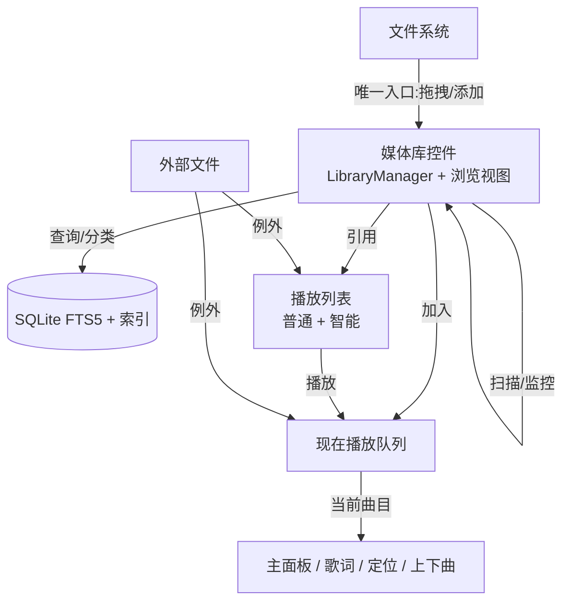

# WusicPlayer 交互设计(媒体库 / 播放列表 / 现在播放队列)

> 编号对应 `0-todolist.md`;本文档为阶段 6+ 的交互与架构设计,先于实现定稿。

---

## 0. 背景:当前 BUG 的根因

**症状**:搜索面板选择曲目(直接从媒体库播放)后,主面板信息不显示;播放列表中 Tab 定位失效。

**根因**:应用目前是**播放列表中心**架构——"当前播放" = 播放列表条目(`PlaylistContext` 里的 `EntryId`),主面板信息、歌词、下一首/上一首、视图定位全部依赖它。阶段 5 让搜索面板**绕过播放列表直接按 filepath 播放**,于是:

- `PlaylistContext` 从未被设置 → 主面板读不到"当前曲目" → 信息不显示
- "当前曲目"不在播放列表视图里 → 定位失效
- 上下曲没有队列上下文

**本质**:出现了两个"当前播放"事实来源(播放列表模型 vs 音频引擎),且**播放来源会持续增加**(库控件、搜索、拖拽、播放列表),播放列表中心模型无法承载。

**结论**:治本方案是引入**现在播放队列(Now Playing Queue)**,把"正在播放什么"与"内容来自哪里"解耦。

---

## 1. 设计目标与原则

1. **单一事实来源**:"当前播放"只存在于 Now Playing 队列,所有 UI 与功能从队列读取。
2. **媒体库为内容中心**:文件/路径的添加只发生在媒体库(它拥有 watched folders);播放列表从媒体库拉取。
3. **来源可混合**:队列项/列表条目允许混合来源(库 `TrackId` / 播放列表 `EntryId` / 外部路径)。
4. **操作就近**:功能归属到所属控件的右键菜单,菜单栏只留应用级操作。
5. **不重仓维护**:特化播放列表用"智能列表(保存的查询)"实现,实时反映库变化。

---

## 2. 整体架构:三层内容模型



| 层 | 职责 | 现有代码基础 |
|---|---|---|
| **媒体库** | 内容事实源:浏览/搜索/分类/文件添加 | `model/library/*`(LibraryManager/Repo/Scanner/Watcher) |
| **播放列表** | 用户编排集合:普通列表 + 智能列表 | `model/playlist/*`(已有 `Track.source` 混合来源) |
| **现在播放队列** | 播放状态唯一来源,与内容来源解耦 | 新增 `model/playback_queue/` |

---

## 3. 现在播放队列(核心,阶段 6 首要)

### 3.1 概念

- 独立于播放列表的播放队列;任意来源的曲目**入队即播**。
- 队列项携带来源引用与元数据:

```cpp
struct QueueItem
{
    // 来源(三者至多一个为主,用于"定位回源")
    TrackId    library_track_id;   // 来自媒体库
    EntryId    playlist_entry_id;  // 来自某播放列表条目(可定位)
    QString    filepath;           // 外部路径(兜底)

    QString source_playlist_name;  // 可选:来源列表名(定位展示)
    TrackMetaData meta;            // 快照,主面板直接读取
};
```

### 3.2 职责与行为

- **入队来源**:媒体库控件、搜索面板、播放列表、外部拖入文件。
- **当前曲目** = 队列当前位置项:
  - 主面板信息/歌词:读 `QueueItem.meta`(不再依赖 `PlaylistContext`)
  - 下一首/上一首:队列内移动;若当前项来自播放列表,可用 `source_playlist_name` 展示"正在播放:列表 X"
  - **Tab 定位**:若 `playlist_entry_id` 有效 → 在来源列表视图中定位;否则(库/外部)→ 定位到媒体库控件,或提示无位置
- **重复策略**:入队时按 `library_track_id` / 规范化路径去重(可选设置:允许重复)。
- **持久化**:关闭前保存队列(替换 `PlaybackRestoreService` 的"找列表条目"逻辑)→ 恢复记忆更健壮(不依赖列表缓存身份)。

### 3.3 与现有代码的衔接

- 新增 `model/playback_queue/`:`PlaybackQueue`(容器)+ `PlaybackQueueController`/`PlaybackQueueService`(编排)。
- `PlaybackController` 改为消费队列而非 filepath 直通。
- `PlaybackService` 的下一首/上一首、恢复服务迁移到队列。
- **播放列表中心模型保留为"内容编排",不再承担"当前播放状态"**。

---

## 4. 媒体库控件(Library Widget)

### 4.1 位置与形态

- 侧边栏**播放列表下方**的独立面板,可折叠/可切换。
- 顶部:搜索框(内嵌,直接走 FTS5,Plain/Prefix 模式)+ 分组切换(艺术家/专辑/流派/文件夹)。
- 主体:媒体库浏览视图(参照 foobox)。

### 4.2 功能

| 操作 | 行为 |
|---|---|
| 浏览 | 全部曲目;按 艺术家/专辑/流派/文件夹 分组 |
| 搜索 | 内嵌搜索框,实时 FTS5 过滤 |
| 双击 | 入队并播放 |
| 右键(选中项) | 播放 / 加入现在播放 / 添加到指定播放列表 / 编辑标签 / 打开所在文件夹 |
| 右键(空白) | 添加文件夹 / 添加文件 / 移除根目录 / 重新扫描 |
| 拖拽 | 文件/文件夹 → 注册为 watched folder(去重)→ 异步扫描 → `sgn_library_changed` |

### 4.3 文件添加 = 库的唯一入口

- 只有媒体库控件拥有 watched folders 的增删。
- 播放列表"添加文件夹"时,内部走同一入口(注册库根目录 + 扫描),而不是各自为政。
- 已实现的 `upgradeExternalTracks`(库扫描到后把外部条目升级为库引用)保留,作为"播放列表反馈"的唯一机制。

---

## 5. 播放列表:优先从媒体库添加 + 解析策略

### 5.1 统一解析流

| 添加方式 | 解析流程 | 未命中默认 | 可覆盖 |
|---|---|---|---|
| 文件夹添加 | 库检查 → 命中:库引用;未命中 → 按策略 | **同步入库**(注册根目录) | 右键"仅外部" |
| 单文件/拖入 | 同上 | **外部文件** | 右键"同步入库" |
| 从库控件拉取 | 直接库引用 | — | — |

### 5.2 配置项(设置面板)

- `添加未入库文件时`:同步入库 / 外部文件 / 每次询问(默认按操作类型,见上表)。
- 列表条目允许混合来源(库引用 + 外部条目),`Track.source` 已支持,无需格式改动。
- 缺失文件:保留条目标 `missing` + UI 置灰 + "移除缺失条目"/(可选)重新定位——沿用阶段 4 实现。

---

## 6. 菜单栏清理

- 菜单栏仅保留:**设置、主题、快捷键、关于、退出**。
- 功能归位:
  - 文件添加/路径管理 → 媒体库控件右键
  - 播放列表 CRUD、导入/导出、排序/分组 → 播放列表控件右键
  - 搜索模式切换 → 搜索面板内
- 防"右键菜单爆炸":常用项置顶,批量操作进子菜单,单菜单 ≤ 8 项为宜。

---

## 7. 智能播放列表(特化播放列表的答案)

### 7.1 为什么

用户习惯"一个播放列表装下整库(15000+)",并需要特化视图。手工维护必然陈旧;媒体库控件解决"浏览全部",智能列表解决"特化视图"。

### 7.2 设计

- **智能播放列表 = 保存的查询**(基于媒体库),实时视图、非拷贝:
  - 示例:`genre=Rock`、`artist=X`、`最近 30 天添加`、`bitrate>320k`、`missing`、`收藏`
- 与普通列表并列显示,图标区分。
- 执行引擎:复用 `LibraryRepo` 的列索引(artist/title/album/genre/year/bitrate/missing)+ FTS5。
- **"整库播放列表"不再需要**:库控件浏览全部;或建一条"全部曲目"智能列表即可播放。
- 手动列表仅保留编排需求(通勤/健身等)。

---

## 8. 实施顺序与验收

| 顺序 | 内容 | 说明 / 验收 |
|---|---|---|
| ① | 现在播放队列 | 搜索/库/列表播放时主面板信息显示、Tab 定位可用;恢复记忆基于队列 |
| ② | 媒体库控件 | 库可浏览/搜索/分组;拖拽添加成为唯一入口;搜索面板 BUG 随之消解 |
| ③ | 播放列表解析策略 + 设置 | 文件夹→同步入库、单文件→外部;配置可改 |
| ④ | 菜单栏清理 | 功能归位各控件右键,菜单栏精简 |
| ⑤ | 智能播放列表 | 保存查询、实时视图、图标区分 |

> ① 是 model 层、② 是 view 层,可并行;③④ 依赖 ①② 的接口稳定;⑤ 依赖 ② 的库浏览能力。
> 每步遵守 `1-design-constraint.md`(最小更新、命名、信号方向、所有权)并补测试。

---

## 9. 风险与注意

1. **队列持久化与列表身份**:队列保存 `TrackId`/`EntryId`/`filepath` 三态,恢复时按序回退解析,避免重蹈"列表条目 id 漂移"覆辙。
2. **智能列表时效性**:库变更(`sgn_library_changed`)时刷新,避免陈旧查询结果。
3. **混合来源 UI**:播放列表中库引用/外部条目需有轻量区分(图标或置灰提示)。
4. **15000+ 性能**:库浏览视图需虚拟化(QTableView/委托)与分批加载;搜索已走 FTS5。
