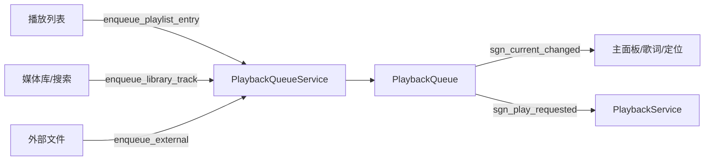

# PlaybackQueue 设计文档(现在播放队列)

> 编号对应 `0-todolist.md` 阶段 7+ ①;依据 `3-interaction-design.md` 第 3 节。
> 定位:**积累期新增模块**,不接入现有播放路径;切断点(阶段 7+ ③)再整体翻转播放模型。

---

## 1. 目标与定位

- 与播放列表**解耦**的播放队列:任意来源(媒体库 / 播放列表 / 搜索 / 外部文件)的曲目入队即成为"当前播放"。
- "当前播放"是队列项,携带来源引用(库 `TrackId` / 列表 `EntryId` / 外部路径),主面板信息、歌词、上下曲、定位统一读队列。
- **本阶段只建模块 + 测试,不改动现有播放列表中心逻辑**(消除双模型风险,切断点一次翻转)。

## 2. 模块结构

```text
src/model/playback_queue/
├── queue_item.h               # QueueItem 实体(纯数据)
├── playback_queue.h/cpp       # 队列容器:入队/移除/移动/当前项/PlayMode 导航
└── playback_queue_service.h/cpp # 门面:来源构建、持久化、信号转发
```

依赖:仅 `core` + `model/playlist`(PlaylistManager) + `model/library`(LibraryManager)。**model 层内,不反向依赖 controller/view**。

## 3. QueueItem 设计

```cpp
struct QueueItem
{
    TrackId    library_track_id;    // 来自媒体库(搜索/库控件)
    EntryId    playlist_entry_id;   // 来自播放列表条目(可定位回源)
    PlaylistId source_playlist_id;  // 来源列表 id
    QString    source_label;        // 展示用来源说明("播放列表:摇滚")
    QString    filepath;            // 规范化路径(最终播放依据)
    TrackMetaData meta;             // 元数据快照(主面板直接读)

    bool is_library() const;
    bool is_playlist() const;
    bool is_external() const;
};
```

- `filepath` 为播放依据;各 id 用于身份与定位,三者互不排斥(如列表条目同时可带库 id)。
- `meta` 为快照,入队时解析一次,避免播放途中再查库。

## 4. PlaybackQueue 行为

| 操作 | 语义 |
|---|---|
| `enqueue(item)` | 追加,返回下标 |
| `enqueue_next(item)` | 插入到当前项之后(无当前项则头部),返回下标 |
| `enqueue_many(items)` | 批量追加,一次信号 |
| `remove_at(i)` | 移除;i<当前 → 当前下标前移;i==当前 → 清空当前 |
| `move(from,to)` | 移动并修正当前下标 |
| `set_current(i)` / `clear_current()` | 设置/清空当前项 |
| `current()` / `item_at(i)` | 越界返回 `std::nullopt` |

### 导航(PlayMode 语义)

| PlayMode | next | prev | 说明 |
|---|---|---|---|
| `in_order` | 当前+1;到达末尾返回 nullopt(不自动回绕) | 当前-1;到首返回 nullopt | 无当前项时 next→0、prev→末尾 |
| `loop` | (当前+1) % size | (当前-1+size) % size | 自动回绕 |
| `shuffle` / `out_of_order_*` | 随机下标 | 随机下标 | 允许重复,简单实现 |

导航成功会更新当前下标并 `emit sgn_current_changed`。

### 信号(数据自下而上)
- `sgn_queue_changed()` — 队列结构变化
- `sgn_current_changed(int index)` — 当前项变化

## 5. PlaybackQueueService(门面)

```cpp
class PlaybackQueueService : public QObject
{
public:
    void set_playlist_manager(PlaylistManager* mgr); // 非拥有,可空
    void set_library_manager(LibraryManager* lib);   // 非拥有,可空
    PlaybackQueue* queue();                          // 非拥有

    bool enqueue_playlist_entry(const PlaylistId& pid, const EntryId& eid);
    bool enqueue_library_track(const TrackId& track_id);
    int  enqueue_external(const QString& filepath, const TrackMetaData& meta = {});

    bool save_to(const QString& path) const;
    bool load_from(const QString& path);

signals:
    void sgn_queue_changed();           // 转发
    void sgn_current_changed(int index); // 转发
    void sgn_play_requested(const QueueItem& item); // 切断点接入 PlaybackService
};
```

- **来源构建**:列表条目经 `PlaylistManager` 解析(filepath + meta 快照);库曲目经 `LibraryManager::track_by_id`;外部文件直接规范化路径。
- **持久化**:JSON(`version` / `current_index` / `items[]`),meta 用模块内局部序列化(暂与 `playlist_repo` 的 meta 序列化重复,后续抽公共工具)。
- **信号**:`sgn_play_requested` 在切断点由 `PlaybackService` 消费(调用 `PlaybackController::read(filepath)`),本阶段只提供信号不接线。

## 6. 与现有代码的关系

| 现有组件 | 本阶段 | 切断点 |
|---|---|---|
| `PlaylistContext` 曲目语义 | 不动 | 移除(当前曲目改由队列承担) |
| `PlaylistViewModel` 队列/快照机制 | 不动 | 移除播放队列构建 |
| `PlaylistManager::nextTrack/prevTrack` | 不动 | 移除,改队列导航 |
| `PlaybackService` 上下曲 | 不动 | 改消费队列 |
| `PlaybackRestoreService` | 不动 | 改队列持久化恢复 |

## 7. 数据流(目标态)



## 8. 测试计划(`test/playback_queue/tb_playback_queue.cpp`)

1. 队列:enqueue / enqueue_next / enqueue_many / remove(含当前)/ move / clear / set_current 边界
2. 导航:in_order 边界不回绕、loop 回绕、shuffle 范围内
3. 持久化:save → load round-trip(条目 + 当前下标 + meta 字段)
4. 服务:外部文件(路径规范化)、列表条目解析(PlaylistManager)、库曲目解析(LibraryManager 扫描后)

## 9. 风险与注意

1. `remove_at` 删除当前项 → 清空当前(不自动播下一首),策略由上层决定。
2. shuffle 允许重复,后续可加"不重复直到播完"。
3. meta 序列化暂重复,切断点后抽取到 `core/utils`。
4. 队列持久化路径尚未接入配置管理,本阶段以显式路径 API 提供。
